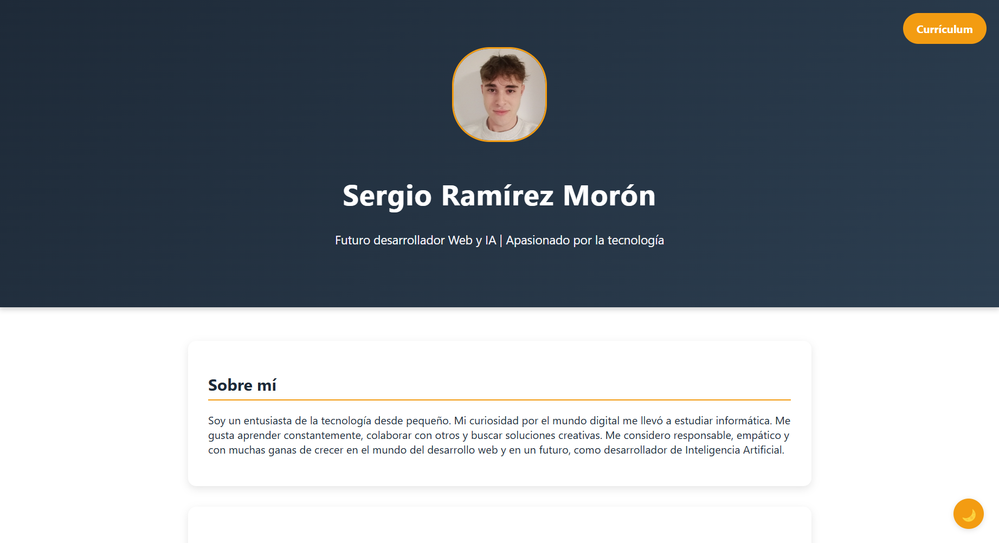
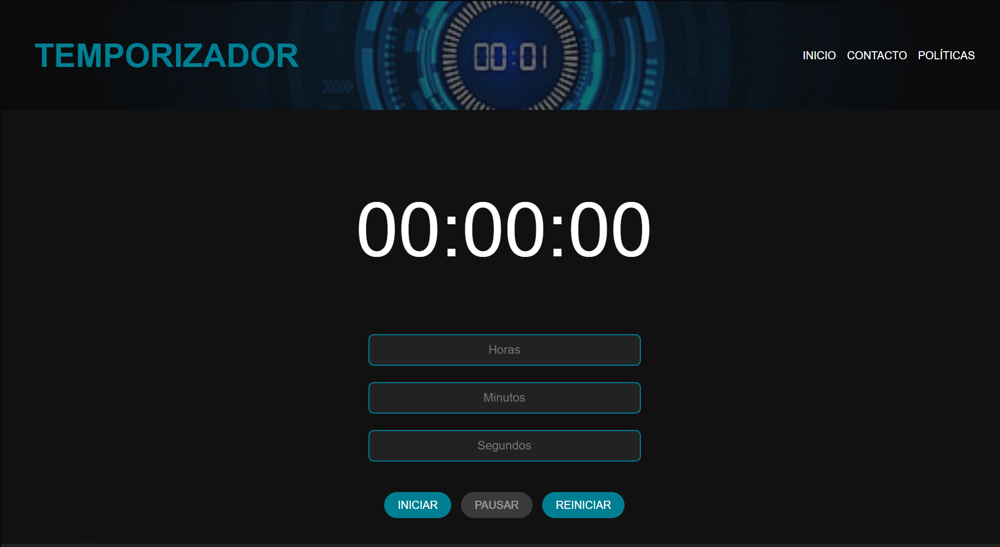
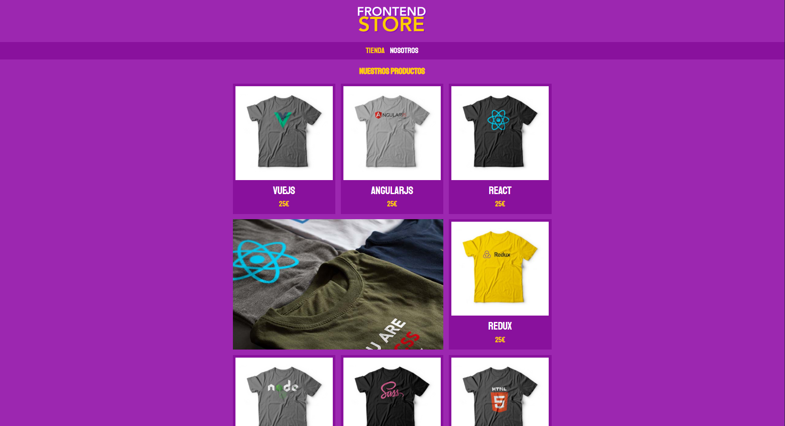

# 👋 ¡Hola! Soy Sergio Ramírez

Soy un jóven que le encanta la tecnología. 
Apasionado por el desarrollo web y la inteligencia artificial.
En constante aprendizaje y con entusiasmo para conseguir mis objetivos.

---

## 📷 Sobre mí

- 💻 **Desarrollador en aprendizaje**
- 🌱 En constante aprendizaje de nuevas herramientas y lenguajes
- 🚀 Enfocado en crear Aplicaciones Web funcionales y atractivas

---

## 📂 Mi Portafolio

  
En mi portafolio encontrarás proyectos y trabajos que reflejan mis habilidades en desarrollo web, diseño de interfaces y optimización de aplicaciones.
- https://portfoliosergioramirezmoron.netlify.app

---

## 🌟 Proyectos Destacados

### ⏳ Temporizador

  
Aplicación web que permite utilizar un temporizador de manera sencilla y visual.

---

### 📌 Tienda Online - Diseño

  
Tienda Online sobre una tienda ficticia vendedora de camisetas de diversas tecnologías.

---

## 📫 Contacto

- ✉️ **Email:** sergioramirezmoron@gmail.com
- 💼 **LinkedIn:** [linkedin.com/in/sergioramirez](https://www.linkedin.com/in/sergio-ramírez-morón-550648357)

---
